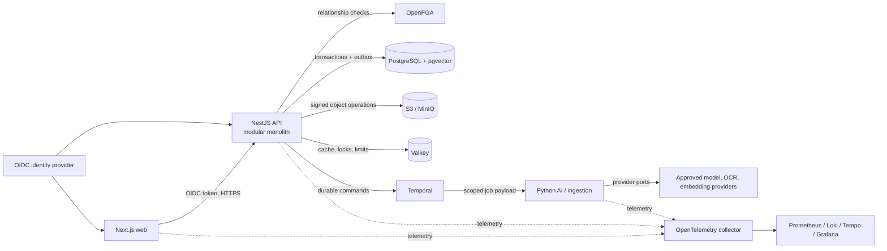

# Architecture overview

Veyra begins as an observable modular monolith plus a narrow Python processing service. PostgreSQL and object storage are authoritative; authorization is centralized in OpenFGA; durable, retryable work belongs in Temporal. This keeps the first vertical slices coherent while preserving seams that can become services only when scale or isolation justifies it.

## Responsibilities and ownership

| Component            | Owns                                                                                    | Must not own                                                      |
| -------------------- | --------------------------------------------------------------------------------------- | ----------------------------------------------------------------- |
| Web                  | Interaction state, rendering, optimistic UX                                             | Authorization truth or provider credentials                       |
| API modular monolith | Domain invariants, tenancy, authorization orchestration, audit, public API              | Binary file bodies or provider-specific AI logic                  |
| Python service       | Parsing, chunking, extraction, retrieval/reranking and model orchestration behind ports | User sessions, canonical permissions, or independent tenant scope |
| PostgreSQL           | Canonical metadata, versions, claims, evidence, workflow references, audit/outbox       | Large binary files                                                |
| Object storage       | Immutable originals/versions and derived artifacts                                      | Search or authorization decisions                                 |
| OpenFGA              | Relationship authorization model and tuples                                             | Authentication or business-record storage                         |
| Temporal             | Durable execution state, retries, timers and workflow version pinning                   | Canonical document/knowledge records                              |
| Valkey               | Rebuildable caches, locks, limits and presence                                          | Permanent business facts                                          |
| Telemetry backends   | Operational traces, metrics and redacted logs                                           | Document content or secrets                                       |

Domain modules communicate through explicit interfaces and in-process domain events. A transactional outbox is used when an event must survive a commit boundary. Kafka, a graph database, and OpenSearch are deferred until measured requirements justify their operational cost.

## Core invariants

- Every tenant-owned row carries an organization identifier; PostgreSQL row-level security is defense in depth, not the only authorization layer.
- User identity is resolved before OpenFGA checks. Search and AI retrieval receive an authorized scope before any candidate content is loaded.
- Every AI citation points to an immutable document version and exact evidence location when available.
- Originals enter a quarantine bucket. Only validated and scanned content becomes trusted or eligible for extraction.
- Provider failures degrade AI features without taking down ordinary document access and lexical search.
- Correlation and trace context cross HTTP, workflow, and provider boundaries; sensitive payloads do not enter telemetry.

## Evolution triggers

PostgreSQL full-text search plus pgvector is the initial retrieval engine. Introduce OpenSearch only after features such as high-cardinality facets, analyzers, typo tolerance, or measured scale exceed the PostgreSQL design. Split a module into a service only when it needs independent scaling, release cadence, failure isolation, or a distinct security boundary. Consider a dedicated graph store only after benchmarked traversals become unsuitable for indexed relational queries.

See [data flow and security boundaries](data-flow-and-security-boundaries.md), [API and AI provider boundaries](api-and-ai-provider-boundaries.md), and the [architecture decisions](../adr/README.md).
