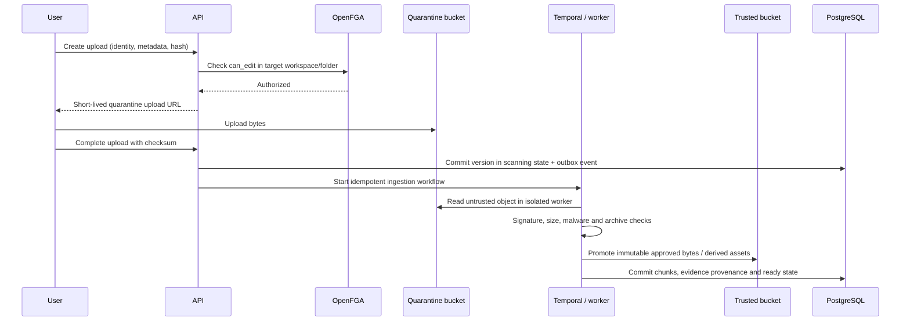
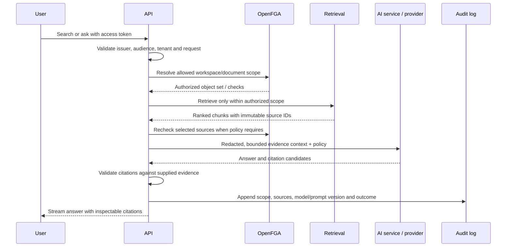

# Data flow and security boundaries

This explanation identifies where identity, trust, and data ownership change. Crossing a boundary requires validation, authorization, telemetry, and a typed failure response.

## Trust zones

| Zone               | Examples                                                       | Trust posture                                                            |
| ------------------ | -------------------------------------------------------------- | ------------------------------------------------------------------------ |
| Untrusted edge     | Browser input, uploads, webhook bodies, connected repositories | Hostile until authenticated, validated, and policy checked               |
| Application        | Web server, API modules, workflow workers                      | Authenticated workload identity; least privilege per interface           |
| Processing sandbox | Parsers, OCR, extraction and preview workers                   | Handles hostile files/content with CPU, memory, time and network limits  |
| Data               | PostgreSQL, object storage, OpenFGA, Valkey                    | Private network; encrypted transport; scoped credentials                 |
| Provider egress    | Model, embedding, OCR and integration providers                | Deny by default; tenant policy, DLP and regional routing apply           |
| Operations         | Telemetry and audit access                                     | Separate privileged roles; redacted content and immutable audit controls |

## Upload and ingestion

The API never accepts a client-provided trusted-object key. Checksums, object size, MIME sniffing, archive expansion limits and malware status are verified server-side. Failed or timed-out processing leaves an inspectable state and audit event; it does not silently promote content.

## Permission-aware search and AI answers

Post-retrieval filtering is not an acceptable tenant boundary. Permission revocation invalidates affected caches and prevents subsequent retrieval, workflow activity, and agent actions. Long-running work rechecks authority at side-effect boundaries.

## Boundary controls

- Public APIs are versioned, rate-limited, schema-validated, and use idempotency keys for retryable mutations.
- Service calls carry workload identity, organization scope, correlation ID and trace context; they do not trust forwarded user identifiers without a signed delegation context.
- Object URLs are short lived, operation-specific, and bound to server-selected keys. Buckets are private.
- Provider egress sends the minimum authorized context and is blocked unless tenant policy permits the provider, model, region, and data class.
- Audit records capture security-sensitive intent and result without storing access tokens, secrets, full prompts, or unrestricted document text.
- Logs and traces use stable IDs and classifications; document content, credentials and signed URLs are redacted at source.
